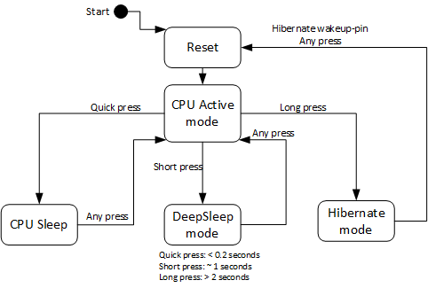
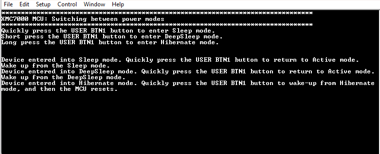
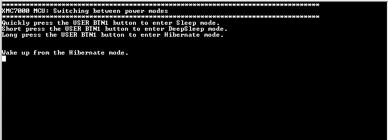

# XMC7000 MCU: Switching between power modes

This example demonstrates how to transition XMC7000 MCU to the Active, Sleep, DeepSleep, and Hibernate power states, and how to wake up and return to Active state. This multi-core application has the main function running on the CM7_0 core.

[View this README on GitHub.](https://github.com/Infineon/mtb-example-xmc7000-switching-power-modes)

[Provide feedback on this code example.](https://cypress.co1.qualtrics.com/jfe/form/SV_1NTns53sK2yiljn?Q_EED=eyJVbmlxdWUgRG9jIElkIjoiQ0UyMzUwMTQiLCJTcGVjIE51bWJlciI6IjAwMi0zNTAxNCIsIkRvYyBUaXRsZSI6IlhNQzcwMDAgTUNVOiBTd2l0Y2hpbmcgYmV0d2VlbiBwb3dlciBtb2RlcyIsInJpZCI6ImtvenUiLCJEb2MgdmVyc2lvbiI6IjIuMC4wIiwiRG9jIExhbmd1YWdlIjoiRW5nbGlzaCIsIkRvYyBEaXZpc2lvbiI6Ik1DRCIsIkRvYyBCVSI6IklDVyIsIkRvYyBGYW1pbHkiOiJQU09DIn0=)

## Overview

This code example shows how to transition the MCU to Active, Sleep, and DeepSleep power states. After transitioning to Sleep, DeepSleep, or Hibernate power state, the example also shows how to wake up and return to Active state.

The project uses a kit button to change the power state. Figure 1 shows the state machine implemented in the firmware to execute the transitions.

**Figure 1. Power modes state machine**



The project also uses an LED to indicate the selected power state. Table 1 shows the state of the LED for each mode.

**Table 1. LED states in various power states**

| **Power/MCU states** | **LED state** |
|-------------------------|---------------|
| Active | Blinks |
| Sleep | Turned ON and dimmed |
| DeepSleep | Turned OFF |
| Hibernate | Turned OFF |

## Requirements

- [ModusToolbox&trade;](https://www.infineon.com/modustoolbox) v3.1 or later (tested with v3.1)
- Programming language: C
- Associated parts: [XMC7000 MCU](https://www.infineon.com/cms/en/product/microcontroller/32-bit-industrial-microcontroller-based-on-arm-cortex-m/)


## Supported toolchains (make variable 'TOOLCHAIN')

- GNU Arm&reg; Embedded Compiler v11.3.1 (`GCC_ARM`) – Default value of `TOOLCHAIN`

- Arm&reg; Compiler v6.16 (`ARM`)
- IAR C/C++ Compiler v9.30.1 (`IAR`)


## Supported kits (make variable 'TARGET')

- [XMC7200 Evaluation Kit](https://www.infineon.com/KIT_XMC72_EVK) (`KIT_XMC72_EVK`) - Default value of `TARGET`
- [XMC7100 Evaluation Kit](https://www.infineon.com/KIT_XMC71_EVK_LITE_V1) (`KIT_XMC71_EVK_LITE_V1`)

## Hardware setup

This example uses the board's default configuration. See the kit user guide to ensure that the board is configured correctly.

The example does not require any additional hardware to run. However, you can connect an ammeter to measure the current consumed by the MCU device. See the kit guide to learn how to measure the current. It might require changes in the hardware.

## Software setup

Install a terminal emulator if you don't have one. Instructions in this document use [Tera Term](https://teratermproject.github.io/index-en.html).

This example requires no additional software or tools.


## Using the code example

### Create the project

The ModusToolbox&trade; tools package provides the Project Creator as both a GUI tool and a command line tool.

<details><summary><b>Use Project Creator GUI</b></summary>

1. Open the Project Creator GUI tool.

   There are several ways to do this, including launching it from the dashboard or from inside the Eclipse IDE. For more details, see the [Project Creator user guide](https://www.infineon.com/ModusToolboxProjectCreator) (locally available at *{ModusToolbox&trade; install directory}/tools_{version}/project-creator/docs/project-creator.pdf*).

2. On the **Choose Board Support Package (BSP)** page, select a kit supported by this code example. See [Supported kits](#supported-kits-make-variable-target).

   > **Note:** To use this code example for a kit not listed here, you may need to update the source files. If the kit does not have the required resources, the application may not work.

3. On the **Select Application** page:

   a. Select the **Applications(s) Root Path** and the **Target IDE**.

   > **Note:** Depending on how you open the Project Creator tool, these fields may be pre-selected for you.

   b.	Select this code example from the list by enabling its check box.

   > **Note:** You can narrow the list of displayed examples by typing in the filter box.

   c. (Optional) Change the suggested **New Application Name** and **New BSP Name**.

   d. Click **Create** to complete the application creation process.

</details>

<details><summary><b>Use Project Creator CLI</b></summary>

The 'project-creator-cli' tool can be used to create applications from a CLI terminal or from within batch files or shell scripts. This tool is available in the *{ModusToolbox&trade; install directory}/tools_{version}/project-creator/* directory.

Use a CLI terminal to invoke the 'project-creator-cli' tool. On Windows, use the command-line 'modus-shell' program provided in the ModusToolbox&trade; installation instead of a standard Windows command-line application. This shell provides access to all ModusToolbox&trade; tools. You can access it by typing "modus-shell" in the search box in the Windows menu. In Linux and macOS, you can use any terminal application.

The following example clones the "[XMC7000 MCU: Switching between power modes](https://github.com/Infineon/mtb-example-xmc7000-switching-power-modes)" application with the desired name "MyPowerModes" configured for the *KIT_XMC72_EVK* BSP into the specified working directory, *C:/mtb_projects*:

   ```
   project-creator-cli --board-id KIT_XMC72_EVK --app-id mtb-example-xmc7000-switching-power-modes --user-app-name MyPowerModes --target-dir "C:/mtb_projects"
   ```

<mark>Update the above paragraph and commands to match your CE.

The 'project-creator-cli' tool has the following arguments:

Argument | Description | Required/optional
---------|-------------|-----------
`--board-id` | Defined in the <id> field of the [BSP](https://github.com/Infineon?q=bsp-manifest&type=&language=&sort=) manifest | Required
`--app-id`   | Defined in the <id> field of the [CE](https://github.com/Infineon?q=ce-manifest&type=&language=&sort=) manifest | Required
`--target-dir`| Specify the directory in which the application is to be created if you prefer not to use the default current working directory | Optional
`--user-app-name`| Specify the name of the application if you prefer to have a name other than the example's default name | Optional

> **Note:** The project-creator-cli tool uses the `git clone` and `make getlibs` commands to fetch the repository and import the required libraries. For details, see the "Project creator tools" section of the [ModusToolbox&trade; tools package user guide](https://www.infineon.com/ModusToolboxUserGuide) (locally available at {ModusToolbox&trade; install directory}/docs_{version}/mtb_user_guide.pdf).

</details>


### Open the project

After the project has been created, you can open it in your preferred development environment.


<details><summary><b>Eclipse IDE</b></summary>

If you opened the Project Creator tool from the included Eclipse IDE, the project will open in Eclipse automatically.

For more details, see the [Eclipse IDE for ModusToolbox&trade; user guide](https://www.infineon.com/MTBEclipseIDEUserGuide) (locally available at *{ModusToolbox&trade; install directory}/docs_{version}/mt_ide_user_guide.pdf*).

</details>


<details><summary><b>Visual Studio (VS) Code</b></summary>

Launch VS Code manually, and then open the generated *{project-name}.code-workspace* file located in the project directory.

For more details, see the [Visual Studio Code for ModusToolbox&trade; user guide](https://www.infineon.com/MTBVSCodeUserGuide) (locally available at *{ModusToolbox&trade; install directory}/docs_{version}/mt_vscode_user_guide.pdf*).

</details>


<details><summary><b>Keil µVision</b></summary>

Double-click the generated *{project-name}.cprj* file to launch the Keil µVision IDE.

For more details, see the [Keil µVision for ModusToolbox&trade; user guide](https://www.infineon.com/MTBuVisionUserGuide) (locally available at *{ModusToolbox&trade; install directory}/docs_{version}/mt_uvision_user_guide.pdf*).

</details>


<details><summary><b>IAR Embedded Workbench</b></summary>

Open IAR Embedded Workbench manually, and create a new project. Then select the generated *{project-name}.ipcf* file located in the project directory.

For more details, see the [IAR Embedded Workbench for ModusToolbox&trade; user guide](https://www.infineon.com/MTBIARUserGuide) (locally available at *{ModusToolbox&trade; install directory}/docs_{version}/mt_iar_user_guide.pdf*).

</details>


<details><summary><b>Command line</b></summary>

If you prefer to use the CLI, open the appropriate terminal, and navigate to the project directory. On Windows, use the command-line 'modus-shell' program; on Linux and macOS, you can use any terminal application. From there, you can run various `make` commands.

For more details, see the [ModusToolbox&trade; tools package user guide](https://www.infineon.com/ModusToolboxUserGuide) (locally available at *{ModusToolbox&trade; install directory}/docs_{version}/mtb_user_guide.pdf*).

</details>


## Operation

1. Connect the board to your PC using the provided USB cable through the KitProg3 USB connector.

2. Open a terminal program and select the KitProg3 COM port. Set the serial port parameters to 8N1 and 115200 baud.

3. Program the board using one of the following:

   <details><summary><b>Using Eclipse IDE</b></summary>

      1. Select the application project in the Project Explorer.

      2. In the **Quick Panel**, scroll down, and click **\<Application Name> Program (KitProg3_MiniProg4)**.
   </details>


   <details><summary><b>In other IDEs</b></summary>

   Follow the instructions in your preferred IDE.
   </details>


   <details><summary><b>Using CLI</b></summary>

     From the terminal, execute the `make program` command to build and program the application using the default toolchain to the default target. The default toolchain is specified in the application's Makefile but you can override this value manually:
      ```
      make program TOOLCHAIN=<toolchain>
      ```

      Example:
      ```
      make program TOOLCHAIN=GCC_ARM
      ```
   </details>

4. After programming, the application starts automatically. Confirm that kit LED blinks at 3 Hz (approximately). Take note of the current consumption. The device is in the Active state at this moment.

5. Quickly press the kit button to transition the device into Sleep power state. Observe that the LED is ON and dimmed. Confirm that the current consumption drops to dozens of milliamperes. The CPU is in the Sleep state at this moment.

6. Quickly press the kit button to return to Active state. Observe that the LED blinks again.

7. Press the kit button for approximately one second and release it. Observe that the LED is OFF and that the current consumption has dropped to over a hundred microamperes. The device is in DeepSleep state at this moment.

8. Quickly press the kit button to return to Active power state. Observe that the LED blinks again and that the current consumption has increased to the same level measured before.

9. Press the kit button for at least two seconds and release it. Observe that the LED is OFF and that the current consumption has dropped to approximately ten microamperes. The device is in Hibernate state at this moment. After steps 4 - 9, the terminal application displays the message as follows:

    **Figure 2. Terminal output**

    

10. Quickly press the kit button to wake up from Hibernate power state, and then MCU reset. Observe that the LED is blinking again. When woken up from Hibernate mode, the terminal application displays the message as follows:

    **Figure 3. Hibernate wakeup terminal output**

    


## Debugging

You can debug the example to step through the code.


<details><summary><b>In Eclipse IDE</b></summary>

Use the **\<Application Name> Debug (KitProg3_MiniProg4)** configuration in the **Quick Panel**. For details, see the "Program and debug" section in the [Eclipse IDE for ModusToolbox&trade; user guide](https://www.infineon.com/MTBEclipseIDEUserGuide).


> **Note:** **(Only while debugging)** On the debugging CPU, some code in `main()` may execute before the debugger halts at the beginning of `main()`. This means that some code executes twice – once before the debugger stops execution, and again after the debugger resets the program counter to the beginning of `main()`. See [KBA231071](https://community.infineon.com/docs/DOC-21143) to learn about this and for the workaround.

</details>


<details><summary><b>In other IDEs</b></summary>

Follow the instructions in your preferred IDE.
</details>


## Design and implementation

This example configures the PWM to blink, dim, and turn ON/OFF the LED. The firmware implements the state machine shown in the [Overview](#overview) section and controls the duty cycle of the PWM block. The device wakes up when a switch press is detected.

Power management callback functions are registered as PWM callbacks. Table 2 shows the actions of callback function for every power state. For more information on power callbacks, see the HAL driver - System Power Management.

**Table 2. Transition actions**

| Callback | Power state | CHECK_READY | CHECK_FAIL | BEFORE_TRANSITION | AFTER_TRANSITION |
|---|---| ---| --- | --- | --- |
| PWM callback | Sleep | Nothing | Nothing | Dim the LED. | Blink the LED. |
| PWM callback | DeepSleep | Nothing | Nothing | Stop PWM | Re-enable the PWM block. Blink the LED. |
| PWM callback | Hibernate | Nothing | Nothing | Stop PWM | Nothing |

<br>

### Resources and settings

**Table 3. Application resources**

| Resource  |  Alias/object     |    Purpose     |
| :------- | :------------    | :------------ |
| PWM (HAL) | pwm | Used to control the LED |
| GPIO (HAL) | CYBSP_USER_BTN | Used to wake up the device and change power states |
| UART (HAL) | cy_retarget_io_uart_obj | UART HAL object used by Retarget-IO for Debug UART port |


## Related resources

Resources | Links
-----------|------------------
Application notes | [AN234334](https://www.infineon.com/AN234334) – Getting started with XMC7000 MCU on ModusToolbox&trade; software <br> [AN234021](https://www.infineon.com/AN234023) – Low-power mode procedure in XMC7000 family
Code examples | [Using ModusToolbox&trade; software](https://github.com/Infineon/Code-Examples-for-ModusToolbox-Software) on GitHub
Device documentation | [XMC7000 MCU datasheets](https://www.infineon.com/cms/en/product/microcontroller/32-bit-industrial-microcontroller-based-on-arm-cortex-m/) <br> [XMC7000 technical reference manuals](https://www.infineon.com/cms/en/product/microcontroller/32-bit-industrial-microcontroller-based-on-arm-cortex-m/)
Development kits | [XMC&trade; eval boards](https://www.infineon.com/cms/en/product/microcontroller/32-bit-industrial-microcontroller-based-on-arm-cortex-m/#boards)
Libraries on GitHub  | [mtb-pdl-cat1](https://github.com/Infineon/mtb-pdl-cat1) – Peripheral Driver Library (PDL)  <br> [mtb-hal-cat1](https://github.com/Infineon/mtb-hal-cat1) – Hardware Abstraction Layer (HAL) library <br> [retarget-io](https://github.com/Infineon/retarget-io) – Utility library to retarget STDIO messages to a UART port
Middleware on GitHub  | [mcu-middleware](https://github.com/Infineon/modustoolbox-software) – Links to all MCU middleware
Tools  | [ModusToolbox&trade;](https://www.infineon.com/modustoolbox) – ModusToolbox&trade; software is a collection of easy-to-use libraries and tools enabling rapid development with Infineon MCUs for applications ranging from wireless and cloud-connected systems, edge AI/ML, embedded sense and control, to wired USB connectivity using PSoC&trade; Industrial/IoT MCUs, AIROC&trade; Wi-Fi and Bluetooth&reg; connectivity devices, XMC&trade; Industrial MCUs, and EZ-USB&trade;/EZ-PD&trade; wired connectivity controllers. ModusToolbox&trade; incorporates a comprehensive set of BSPs, HAL, libraries, configuration tools, and provides support for industry-standard IDEs to fast-track your embedded application development.

<br />

## Other resources

Infineon provides a wealth of data at www.infineon.com to help you select the right device, and quickly and effectively integrate it into your design.

For XMC&trade; MCU devices, see [32-bit XMC™ industrial microcontroller based on Arm® Cortex®-M](https://www.infineon.com/cms/en/product/microcontroller/32-bit-industrial-microcontroller-based-on-arm-cortex-m/).

## Document history

Document title: *CE235014* – *XMC7000 MCU: Switching between power modes*

 Version | Description of change
 ------- | ---------------------
 1.0.0   | New code example
 2.0.0   | Added support for KIT_XMC71_EVK_LITE_V1
<br />

All referenced product or service names and trademarks are the property of their respective owners.

The Bluetooth&reg; word mark and logos are registered trademarks owned by Bluetooth SIG, Inc., and any use of such marks by Infineon is under license.


---------------------------------------------------------

© Cypress Semiconductor Corporation, 2022-2023. This document is the property of Cypress Semiconductor Corporation, an Infineon Technologies company, and its affiliates ("Cypress").  This document, including any software or firmware included or referenced in this document ("Software"), is owned by Cypress under the intellectual property laws and treaties of the United States and other countries worldwide.  Cypress reserves all rights under such laws and treaties and does not, except as specifically stated in this paragraph, grant any license under its patents, copyrights, trademarks, or other intellectual property rights.  If the Software is not accompanied by a license agreement and you do not otherwise have a written agreement with Cypress governing the use of the Software, then Cypress hereby grants you a personal, non-exclusive, nontransferable license (without the right to sublicense) (1) under its copyright rights in the Software (a) for Software provided in source code form, to modify and reproduce the Software solely for use with Cypress hardware products, only internally within your organization, and (b) to distribute the Software in binary code form externally to end users (either directly or indirectly through resellers and distributors), solely for use on Cypress hardware product units, and (2) under those claims of Cypress's patents that are infringed by the Software (as provided by Cypress, unmodified) to make, use, distribute, and import the Software solely for use with Cypress hardware products.  Any other use, reproduction, modification, translation, or compilation of the Software is prohibited.
<br>
TO THE EXTENT PERMITTED BY APPLICABLE LAW, CYPRESS MAKES NO WARRANTY OF ANY KIND, EXPRESS OR IMPLIED, WITH REGARD TO THIS DOCUMENT OR ANY SOFTWARE OR ACCOMPANYING HARDWARE, INCLUDING, BUT NOT LIMITED TO, THE IMPLIED WARRANTIES OF MERCHANTABILITY AND FITNESS FOR A PARTICULAR PURPOSE.  No computing device can be absolutely secure.  Therefore, despite security measures implemented in Cypress hardware or software products, Cypress shall have no liability arising out of any security breach, such as unauthorized access to or use of a Cypress product. CYPRESS DOES NOT REPRESENT, WARRANT, OR GUARANTEE THAT CYPRESS PRODUCTS, OR SYSTEMS CREATED USING CYPRESS PRODUCTS, WILL BE FREE FROM CORRUPTION, ATTACK, VIRUSES, INTERFERENCE, HACKING, DATA LOSS OR THEFT, OR OTHER SECURITY INTRUSION (collectively, "Security Breach").  Cypress disclaims any liability relating to any Security Breach, and you shall and hereby do release Cypress from any claim, damage, or other liability arising from any Security Breach.  In addition, the products described in these materials may contain design defects or errors known as errata which may cause the product to deviate from published specifications. To the extent permitted by applicable law, Cypress reserves the right to make changes to this document without further notice. Cypress does not assume any liability arising out of the application or use of any product or circuit described in this document. Any information provided in this document, including any sample design information or programming code, is provided only for reference purposes.  It is the responsibility of the user of this document to properly design, program, and test the functionality and safety of any application made of this information and any resulting product.  "High-Risk Device" means any device or system whose failure could cause personal injury, death, or property damage.  Examples of High-Risk Devices are weapons, nuclear installations, surgical implants, and other medical devices.  "Critical Component" means any component of a High-Risk Device whose failure to perform can be reasonably expected to cause, directly or indirectly, the failure of the High-Risk Device, or to affect its safety or effectiveness.  Cypress is not liable, in whole or in part, and you shall and hereby do release Cypress from any claim, damage, or other liability arising from any use of a Cypress product as a Critical Component in a High-Risk Device. You shall indemnify and hold Cypress, including its affiliates, and its directors, officers, employees, agents, distributors, and assigns harmless from and against all claims, costs, damages, and expenses, arising out of any claim, including claims for product liability, personal injury or death, or property damage arising from any use of a Cypress product as a Critical Component in a High-Risk Device. Cypress products are not intended or authorized for use as a Critical Component in any High-Risk Device except to the limited extent that (i) Cypress's published data sheet for the product explicitly states Cypress has qualified the product for use in a specific High-Risk Device, or (ii) Cypress has given you advance written authorization to use the product as a Critical Component in the specific High-Risk Device and you have signed a separate indemnification agreement.
<br>
Cypress, the Cypress logo, and combinations thereof, ModusToolbox, PSoC, CAPSENSE, EZ-USB, F-RAM, and TRAVEO are trademarks or registered trademarks of Cypress or a subsidiary of Cypress in the United States or in other countries. For a more complete list of Cypress trademarks, visit www.infineon.com. Other names and brands may be claimed as property of their respective owners.
